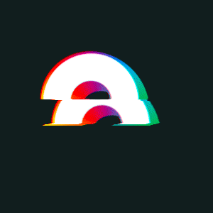

```
########     ###    #### ##    ## ########   #######  ##      ##  ######     ########     ###     #######
##     ##   ## ##    ##  ###   ## ##     ## ##     ## ##  ##  ## ##    ##    ##     ##   ## ##   ##     ##
##     ##  ##   ##   ##  ####  ## ##     ## ##     ## ##  ##  ## ##          ##     ##  ##   ##  ##     ##
########  ##     ##  ##  ## ## ## ########  ##     ## ##  ##  ##  ######     ##     ## ##     ## ##     ##
##   ##   #########  ##  ##  #### ##     ## ##     ## ##  ##  ##       ##    ##     ## ######### ##     ##
##    ##  ##     ##  ##  ##   ### ##     ## ##     ## ##  ##  ## ##    ##    ##     ## ##     ## ##     ##
##     ## ##     ## #### ##    ## ########   #######   ###  ###   ######     ########  ##     ##  #######
```

# What is Rainbows DAO

Rainbows is a decentralized non-custodial application leveraging the latest technology at the service of the common good. Users can create, manage or get involved into groups, so called loops. Each loop shares a dedicated virtuosity purpose and users must collaborate to complete its specific mission.

<p align="center">
  
</p>

## Official Links

- [Docs](https://blockswan-hq.gitbook.io/rainbows-dao/)
- Website coming soon

## Connect with the community

You can join us in the [Discord]() or at the [Twitter](). Feel free to ask any questions about the protocol, talk about Rainbows, or discuss how we can make the world better with other peers.
